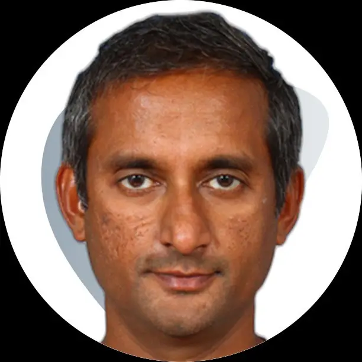

# Welcome to Github home of Girish Venkatachalam

## Who am I?

I am a digital nomad.

I also have a personal [page](https://girishvenkatachalam.me)

## What do I do?

I write code. Some of which are quite popular.

[LiveUSB OpenBSD](https://liveusb-openbsd.sourceforge.io)

and Vim multitail plugin and many more.

## Projects

My [github page](https://github.com/girish1729) has it all.

Also creator of [SpamCheetah email security](https://www.spamcheetah.com)

## Hobbies

I love cooking, bicycling, yoga and meditation.

## Contact

[Email me](mailto:girish@spamcheetah.com)

## Twitter 

I am pretty regular on Twitter too.

<a href="https://twitter.com/girish1729?ref_src=twsrc%5Etfw" class="twitter-follow-button" data-show-count="false">Follow @girish1729</a>

## Mandatory Buy me a coffee link

## Substack newsletter

[This](https://girishvenkatachalam.substack.com) is my substack page for
subscribing to my newsletter.

I want to own my audience as opposed to rent , but you never meet folks
in your house. You always go out and meet them at a public place...

## Gumroad creations

[This](https://girish1729.gumroad.com/) is my Gumroad page where I publish
my ebooks and other digital assets.

## Linkedin 

[Linkedin](https://linkedin.com/in/girishvenkatachalam) is also a place
where my projects are listed(mostly commercial).

## Tech stack

I am old OpenBSD fan and the thrill still continues. I used to maintain
ports in OpenBSD and I am also into Linux.

I am a command line geek and write text mails in [vim
editor](https://www.vim.org) and use [mutt](http://www.mutt.org) for my
email traffic.

No , I don't use Gmail. My email server is hosted in
[Hetzner](https://www.hetzner.com)

As such I am an easy going guy with a geek mindset.

## Other

Being a digital nomad I really have plenty of time or no time at all. I
have never worked in a regular job since May 18, 2005.

